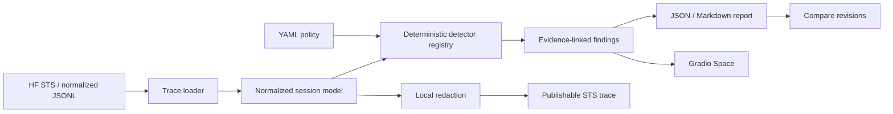

# Architecture

## Design principles

1. **Evidence before score.** Every finding points to a message or tool-call position.
2. **Policy is explicit.** Allowed tools, paths, hosts, approvals, retries, and secret patterns are configured outside the model.
3. **No model required.** The first release is deterministic and offline so fixture behavior is reproducible.
4. **Adapters are replaceable.** The normalized session model isolates trace formats from detectors.
5. **Publication is not automatic.** Download and local analysis are supported; uploading remains an explicit user action.

## Current adapters

- Hugging Face Session Trace Simple Format (STS)
- One-row normalized dataset records with a `messages` array
- OpenAI-style message JSONL

Raw Claude Code, Codex, Pi, Hermes, and other native formats are intentionally not claimed as fully supported yet. The next adapter milestone will use public fixture traces and conformance tests rather than heuristic parsing.
